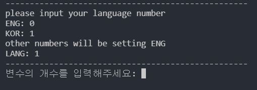
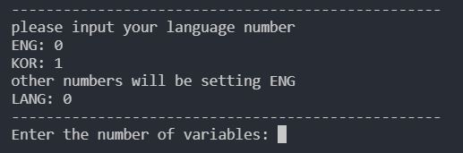
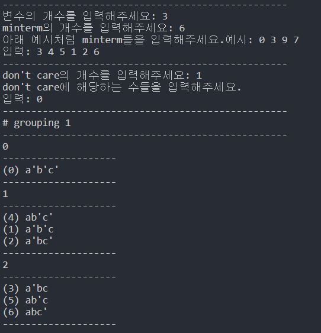
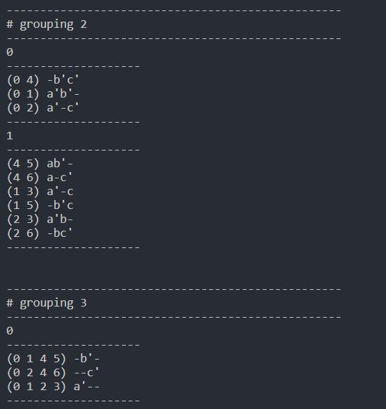
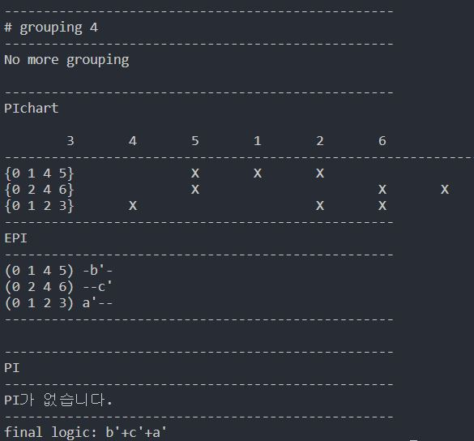

# tabular-method-cli

<div class = "shields" style = "display: flex; "> 
    
    
    
    
    
    
    
</div>

## introduce
국민대학교 논리회로설계 강의 시간 중, tabular method를 배우게 되었습니다.

강의 중 과제로 만들게 된 tabular method cli 소스입니다.

## usage
main.cpp를 g++ 컴파일러로 컴파일/실행해주세요.

## global variable
```cpp
struct rows {
    vector <int> minterms; // minterm 목록(뭉쳐지는 minterm들을 하나의 벡터에 저장함.)
    vector <int> expression; // minterm 목록에서 대응되는 이진수 표현
};

int lang = 0; // 선택된 언어
unsigned int numOfVar; // 변수 개수
unsigned int numOfMinterm; // minterm 개수
unsigned int numOfDontcare; // dontcare 개수
vector <int> minterm; // 입력받은 minterm 벡터
vector <int> dontcare; // 입력받은 dontcare 벡터
vector<vector<rows>> termList; //minterm, dontcare를 합쳐논 목록
vector<rows> totalrow; // PIchart, PI, EPI를 구하는 최종 minterm들을 모아놓음.
vector<vector<int>> PIchart; //PIchart date
vector <rows> EPI; // EPI 목록
vector <rows> PI; // PI 목록
vector <int> checkPI; // EPI, PI를 활용해 논리식에 포함되는 PI를 판단하는 dfs를 수행할 때, 중복 방지 check 배열 역할
map <int, int> M; // key = minterm, value = 0+ or -1, if value == -1 -> dontcare 
int ansCount = (int)1e8; // 최대값 init
int ansSizeSum = -1; // 최소값 init
vector <int> ansCheck; // dfs 수행중, 최종 논리식을 구성하는 PI가 무엇인지 저장해놓는 벡터

vector <vector <string>> msg; // 언어별 메세지
```

## function

### main
```cpp
int main() {
    inputLanguage();
    if(!inputNumbers()) {
        inputErrorMsg();
        return 0;
    }
    tabularMethod();
}
```

### others function
```cpp
void inputLanguage(); // input language number
void printLine(); // print "-" * 50
void printLine(int k); // print "-" * k

bool inputNumbers(); // input numbers
bool mintermValidation(); //minterm이 유효한가
bool dontcareValidation(); // dontcare가 유효한가
void inputErrorMsg(); // input Error 메세지 출력

void tabularMethod(); // tabular method 전체

int countOne(vector<int> V); // 이진화된  minterm에서 1의 개수를 return
void setTermList(); // 그룹핑 전에, minterm 세팅(1의 개수에 따라 분류하기) 
void printTermList(); // 그룹핑 과정 중, 1의 개수에 따라 분류된 term 목록 출력 
void deleteDuplicatedTermList(); // 그룹핑 과정 중에, 중복되게 그룹핑 된 minterm 목록 제거

int termDiff(vector <int> V1, vector<int> V2); // 두 이진화된 minterm의 차이 return
void grouping(); // 그룹핑
void makePIchart(); // PI chart 생성 함수
void printPIchart(); // PI chart 출력 함수
void findEPInPI(); // EPI, PI 를 찾는 함수
void PIdfs(int idx); // PI를 선택할지, 안선택할지를 dfs로 탐색함.
void derivecheckedPI(); // PIdfs 과정중, 맨 마지막 PI까지 결정했을 때, 결과값을 확인하는 함수.
void printEPInPI(); // EPI, PI 를 출력하는 함수
void findlogic(); // 최종 논리식 검출 함수

void printMinterm(vector <int> V); // minterm 출력
void printExpression(vector <int> V); // 이진 표현을, 알파벳으로 변환 출력
void printfinalExpression(vector <int> V); // 최종 논리식 변환 출력
void testFunc(); // 테스트 함수
```


## Lang setting
- KOR/ENG version
    - KOR
    

    - ENG
    


## Example

#### 0


#### 1


#### 2


#### 3

